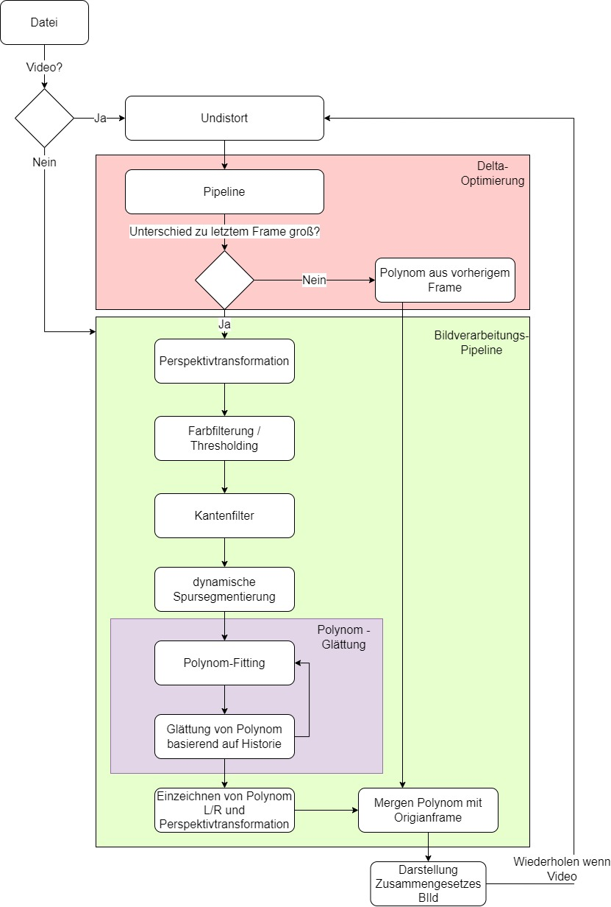

# 🛣️ Lane Marking Detection

This project involves the development of a program for detecting **U.S. road lane markings**. The software was created using **Anaconda** and **OpenCV** within a **Jupyter Notebook** environment. Below, you'll find the exported notebook. The detection and visualization of the lane markings have been **heavily optimized for computational efficiency**.

🎥 **A snippet from the live-rendered output video:**

https://user-images.githubusercontent.com/72473553/177058944-ea20ac48-d839-4e1f-bc20-94371525db1e.mp4

Detected lane lines are highlighted in **red**, and the calculated **lane curvature radius** is shown in the top-right corner.

---

## 📓 Jupyter Notebook

```python
import cv2 as cv
from matplotlib import pyplot as plt
import numpy as np
import os
import glob
import time

print('Welcome to the "Lane Marking Detection" project 🚗🛣️')
```

---

```python
"""
  # Helper function to display images with a title
  # This function shows one image per call
"""
def showimg(img, title):
    plt.imshow(img)
    plt.title(title)
    plt.show()
```

---

## 🎯 Camera Calibration to Undistort Images

The input images are distorted due to lens and camera characteristics. These distortions are corrected using **OpenCV's camera calibration tools**
(see: [https://docs.opencv.org/4.5.3/dc/dbb/tutorial\_py\_calibration.html](https://docs.opencv.org/4.5.3/dc/dbb/tutorial_py_calibration.html))
and the corresponding calibration images provided.

```python
"""
  # Compute calibration data
  # Reads all calibration images and extracts chessboard corner data
"""
# Load and display an example calibration image
img_cal_1 = cv.cvtColor(cv.imread('./img/Udacity/calib/calibration1.jpg'), cv.COLOR_BGR2RGB)
showimg(img_cal_1, 'Calibration Image')

# Load paths of all calibration images
calibration_paths = glob.glob('./img/Udacity/calib/*.jpg')

# Prepare object points and image points
calib_points = []   # 2D points in image plane
obj_points = []     # 3D points in real world space

# 3D points in real world space (chessboard coordinates)
objp = np.zeros((6*9, 3), np.float32)
objp[:, :2] = np.mgrid[0:9, 0:6].T.reshape(-1, 2)

# Loop through all calibration images
for path in calibration_paths:
    img = cv.cvtColor(cv.imread(path), cv.COLOR_BGR2RGB)

    # Find chessboard corners
    ret, points = cv.findChessboardCorners(img, (9, 6), None)  # 9 inner corners horizontal, 6 vertical

    if ret:
        calib_points.append(points)
        obj_points.append(objp)
```

### 📷 Calibration Image


---

```python
"""
  # Function to compute camera calibration:
  # This is done only once at the beginning to improve performance.
  # After that, every frame is undistorted using the precomputed remap matrices.
"""
def calibrate():
    size_1 = (1280, 720)  # Define image size (faster than auto-detection)

    # Compute camera matrix and distortion coefficients
    _, mtx, dist, _, _ = cv.calibrateCamera(obj_points, calib_points, size_1, None, None)
    newcameramtx, roi = cv.getOptimalNewCameraMatrix(mtx, dist, size_1, 0, size_1)

    # Compute remap for undistortion
    mapx, mapy = cv.initUndistortRectifyMap(mtx, dist, None, newcameramtx, size_1, 5)

    # Define region of interest
    x, y, w, h = roi

    # Precompute slices for faster processing
    x = slice(x, x + w)
    y = slice(y, y + h)

    return mapx, mapy, x, y
```

---

```python
"""
  # Function to undistort a single image using the precomputed calibration maps
"""
def undistort_image(img, mapx, mapy, x, y):
    # Remap the image using nearest neighbor interpolation for performance
    undist_img = cv.remap(img, mapx, mapy, cv.INTER_NEAREST)

    # Crop to the region of interest
    new_frame = undist_img[y, x]

    return new_frame

# Run example with the first calibration image
# Original Image:
showimg(img_cal_1, 'Original Calibration Image')

# Calibrate and undistort
mapx, mapy, x, y = calibrate()
img_cal_1_undistorted = undistort_image(img_cal_1, mapx, mapy, x, y)

# Display the undistorted result
showimg(img_cal_1_undistorted, 'Calibrated and Undistorted Image')
```

---

### 🖼️ Original Calibration Image


---

### 🛠️ Calibrated and Undistorted Image


---

## 🛰️ Perspective Transformation with Region of Interest (ROI)

Due to the camera's angled view, the detected curvature of the lane markings does **not** match the **real-world curvature** of the driving lanes.
To correct this, the image is transformed from the camera’s perspective to a **bird’s-eye view** (top-down), which better reflects the true curvature of the road.

---

```python
"""
  # Function to calculate transformation matrices between camera view and bird's-eye view
"""
def calc_perspective():
    # Points in the original image (camera perspective)
    r_1 = [598, 448]
    r_2 = [684, 448]
    r_3 = [1026, 668]
    r_4 = [278, 668]
    
    # Corresponding points in the bird's-eye view (optimized for quality & performance)
    t_1 = [250, 0]
    t_2 = [980, 0]
    t_3 = [980, 629]
    t_4 = [250, 629]
    
    # Create arrays of source and destination points
    input_points = np.float32([r_1, r_2, r_3, r_4])
    output_points = np.float32([t_1, t_2, t_3, t_4])
    
    # Compute the perspective transform matrix (camera → bird's-eye)
    M = cv.getPerspectiveTransform(input_points, output_points)
    
    # Compute the inverse matrix (bird's-eye → camera)
    M_rev = cv.getPerspectiveTransform(output_points, input_points)
    
    return M, M_rev
```

---

```python
"""
  # Function to apply the perspective transform to get the bird's-eye view
"""
def transform_perspective(curr_img, M):
    # Optional: cut off sky area (not necessary due to transformation)
    # curr_img[0:400, :, :] = 0
    
    # Define the size of the output image
    curr_img_size = (curr_img.shape[1], curr_img.shape[0])
    
    # Apply perspective warp using the transformation matrix
    new_warped_img = cv.warpPerspective(curr_img, M, curr_img_size, flags=cv.INTER_NEAREST)
    
    return new_warped_img
```

---

## 🚗 Lane Marking Detection

### ✅ Completed Tasks:

* ✔ **Segmentation**: Restrict the image to the area where lane markings are likely located.
* ✔ **Preprocessing**: Perform camera calibration (for Udacity image sources) and perspective transformation.
* ✔ **Color Spaces & Histograms**: Detect lane markings in the typical colors found in the dataset. If multiple markings are present, prioritize those that define the ego lane.
* ✔ **Performance**: Image processing must work in real-time — target: **> 20 FPS** on the reference system.
* ✔ **Optimization**: Implement further improvements (e.g., detect lane markings in early frames, then track them in subsequent frames unless drastic changes occur).
* ✔ **Video**: Lane lines are continuously detected throughout the `project_video`.
* ✔ ***Additional Enhancements***: Explore further speed improvements.
  **SOLUTION**: Caching images and performing full detection only in initial frames. In later frames, track the existing lane lines unless their positions change significantly.

> 💡 **Note**: Developed on macOS. You may need to **remove `cv.waitKey(1)`** when running on Windows.

---

## 🔁 Pipeline Overview

<p align="center">

</p>

---

## 🎨 Color Filtering with Thresholding

```python
def thresholding(frame):
    """
    # Applies a color threshold to highlight relevant regions in the image.
    # The HLS color space is used to better control lightness.
    """
    # Convert to HLS color space for better selectivity
    frame = cv.cvtColor(frame, cv.COLOR_RGB2HLS)

    # Create mask for yellow lane lines
    mask_yellow = cv.inRange(frame, (10, 28, 115), (38, 204, 255))

    # Create mask for white lane lines
    mask_white = cv.inRange(frame, (0, 195, 0), (255, 255, 255))

    # Combine masks
    mask_comb = mask_yellow | mask_white

    # Zero out everything outside the color masks
    frame[np.where(mask_comb == 0)] = 0

    global debug
    if debug == 2:
        cv.imshow("frame", frame)

    return frame
```

---

## 📏 Line Extraction Using Laplacian Filter

```python
def line_extraction(frame):
    """
    # Applies the Laplacian edge detector to extract lane lines from the image.
    # Includes preprocessing to remove image noise.
    """
    # Define kernel for morphological opening (noise removal)
    opening_kernel = np.array([[0, 1, 0], [1, 1, 1], [0, 1, 0]], dtype='uint8')

    # Apply the kernel to reduce noise
    frame = cv.morphologyEx(frame, cv.MORPH_OPEN, opening_kernel, iterations=1)

    # Apply Laplacian edge detection (best compromise between speed and accuracy)
    frame = cv.Laplacian(frame[:, :, 0], -1, ksize=7)

    return frame.astype(np.uint8)
```

---

## 🔻 Vertical Segmentation

```python
def vertical_segmentation(frame, segment_count=3):
    """
    # Vertically segments the input frame into `segment_count` regions.
    # For each vertical region:
    #   1. A histogram is calculated.
    #   2. The best X-coordinate for splitting lanes is found using `find_segmentation_middle`.
    #   3.1 For @return `left_lane`, everything to the right of that X is set to 0.
    #   3.2 For @return `right_lane`, everything to the left of that X is set to 0.
    #
    # The function returns two binary images, each isolating one lane line.
    # Multiple vertical segments help accurately detect lanes in sharp and S-shaped curves.
    """
    segmenter_lines = []
    left_lane = frame.copy()
    right_lane = frame.copy()

    # Determine height of each segment
    y = (frame.shape[0] - 1) // segment_count

    for line in range(segment_count):
        # Find optimal X-position to separate left and right lanes
        x = find_segmentation_middle(frame[line * y:(line + 1) * y, :])
        segmenter_lines.append(x)

        # Zero out pixels to the left of X → isolate right lane
        right_lane[line * y:(line + 1) * y, 0:x] = 0

        # Zero out pixels to the right of X → isolate left lane
        left_lane[line * y:(line + 1) * y, x:frame.shape[1] - 1] = 0

        global debug
        if debug == 3:
            cv.line(frame, (x, line * y), (x, (line + 1) * y), (255, 0, 0), 2)

    if debug == 3:
        cv.imshow("frame", frame)

    return left_lane, right_lane
```

---

## 📐 Polynomial Smoothing

```python
right = []
left = []
```

```python
def smooth_points(original, reference, left_la=True):
    """
    # Smooths the polynomial coefficients between frames to reduce jitter.
    # Calculates a change rate based on the absolute difference between new and previous coefficients.
    # Applies smoothing: if the change is small, trust the new values; if large, favor the previous ones.
    """
    # Calculate rate of change (clamped at 0)
    change_rate = max(1 - (np.mean(np.abs(original - reference)) * 1.6), 0)

    global right
    global left
    global debug

    # Track smoothing quality over time
    if left_la:
        left.append(change_rate)
    else:
        right.append(change_rate)

    if debug == 5:
        return original
    else:
        return change_rate * original + (1 - change_rate) * reference
```

---

## 📈 Polynomial Fitting and Lane Curvature Estimation

```python
def polyfit(frame, reference):
    """
    Fits second-degree polynomials to both left and right lane markings
    and calculates the curvature at their respective extrema.

    Returns:
        - result: an image with the lane curves drawn
        - left_curv_rad: curvature radius of the left lane
        - right_curv_rad: curvature radius of the right lane
        - koeff_left: polynomial coefficients for the left lane
        - koeff_right: polynomial coefficients for the right lane
    """
    # Create empty BGR image for drawing
    result = np.zeros((frame.shape[0], frame.shape[1], 3), dtype=np.uint8)

    # Segment the image into left and right lanes
    left_lane, right_lane = vertical_segmentation(frame)

    # Fit 2nd degree polynomial to each lane
    points_left, p_l, max_val_l, koeff_left = poly(left_lane, 2, reference[0])
    points_right, p_r, max_val_r, koeff_right = poly(right_lane, 2, reference[1], sd=False)

    # Draw polylines on result image
    cv.polylines(result, np.int_([points_left, points_right]), isClosed=False, color=(255, 0, 0), thickness=25)

    global debug
    if debug == 4:
        cv.polylines(frame, np.int_([points_left, points_right]), isClosed=False, color=(255, 0, 0), thickness=25)
        cv.imshow("frame", frame)

    # Derive curvature from polynomial derivatives
    pld = np.polyder(p_l)
    prd = np.polyder(p_r)

    left_curv_rad = (1 + (pld(max_val_l) * 2) * 1.5) / np.abs(np.polyder(pld)(max_val_l))
    right_curv_rad = (1 + (prd(max_val_r) * 2) * 1.5) / np.abs(np.polyder(prd)(max_val_r))

    return result, left_curv_rad, right_curv_rad, koeff_left, koeff_right
```

---

## 🧮 Polynomial Fitting for One Lane

```python
def poly(frame, grad, reference, sd=True):
    """
    Fits a polynomial of degree `grad` to non-zero pixels in the lane image,
    and identifies its extremum (e.g., the turning point of a parabola).

    Returns:
        - points: list of (x, y) coordinates on the curve
        - p: fitted polynomial function
        - maxval: index of the curve’s extremum
        - polynom: fitted polynomial coefficients
    """
    height_n = np.linspace(0, frame.shape[1], frame.shape[1])

    # Extract x, y of non-zero pixels (lane points)
    (row, col) = np.nonzero(frame)

    # Conversion factors from pixels to meters
    x_m_per_pix = 30 / 720
    y_m_per_pix = 3.7 / 700

    # Fit polynomial to lane points
    polynom = np.polyfit(x_m_per_pix * row, y_m_per_pix * col, grad)

    # Smooth using previous frame's polynomial, if available
    if reference is not None:
        polynom = np.poly1d(smooth_points(polynom, reference, sd))

    p = np.poly1d(polynom)
    width_n = p(height_n)

    # Find extremum (where derivative is zero)
    maxval = np.argmin(np.abs(np.polyder(p)(height_n)))

    # Convert back to pixel coordinates
    return np.dstack(((1 / y_m_per_pix) * width_n, (1 / x_m_per_pix) * height_n)).astype(np.uint32), p, maxval, polynom
```

---

## 🧭 Histogram-Based Lane Splitting

```python
def find_segmentation_middle(frame):
    """
    Determines the optimal X-coordinate to split the image between left and right lanes.

    Steps:
        - Sum the pixel values column-wise to create a histogram.
        - Smooth the histogram with a convolution kernel.
        - Find peak values from the left and right sides.
        - Return the midpoint between these peaks.

    Returns:
        - segmenter_line: the X-position for splitting the image
    """
    # Smoothing kernel
    kernel = np.ones(40) / 40

    # Create column-wise brightness histogram
    summed = np.sum(frame, axis=0)

    # Smooth the histogram
    smoothed = np.convolve(summed, kernel, mode='same')

    # Initialize peak positions
    left_center = -1
    right_center = -1

    # Search for peaks
    for i, p in enumerate(smoothed):
        if i >= len(smoothed) // 2:
            break
        if smoothed[i + 3] < p and p > smoothed[left_center]:
            left_center = i
        if smoothed[len(smoothed) - i - 4] < smoothed[len(smoothed) - i - 1] and smoothed[len(smoothed) - i - 4] > smoothed[right_center]:
            right_center = len(smoothed) - i

    # Prevent extreme or invalid values
    if right_center > frame.shape[1] - 200:
        right_center = frame.shape[1] - 200
    if right_center == -1:
        right_center = frame.shape[1] // 2
    if left_center < 200:
        left_center = 200

    # Return average of the two peak positions
    return (left_center + right_center) // 2
```

---

## 🔄 Retransform Polylines and Merge with Original Image

```python
def retransform_and_merge(polys, frame, M):
    """
    Applies the inverse perspective transform to the image containing the lane polylines (`polys`).
    Then merges the transformed polylines with the original camera image (`frame`).

    Returns:
        - Combined image with overlaid lane markings.
    """
    polys = transform_perspective(polys, M)
    return cv.addWeighted(frame, 1, polys, 3, 0)
```

---

## 🧾 Add Curvature Radius Text

```python
def write_data(frame, left_curv_rad, right_curv_rad):
    """
    Adds the left and right curvature radii to the image as overlay text.

    Format:
        Left: <left_curv_rad> m
        Right: <right_curv_rad> m
    """
    cv.putText(frame, f" Left:  {left_curv_rad:.2f} m", (1000, 70), 
               cv.FONT_HERSHEY_SIMPLEX, 1, (100, 255, 0), 1, cv.LINE_AA)
    
    cv.putText(frame, f" Right: {right_curv_rad:.2f} m", (1000, 140), 
               cv.FONT_HERSHEY_SIMPLEX, 1, (100, 255, 0), 1, cv.LINE_AA)
    
    return frame
```

---

## 🛠️ Full Lane Detection Pipeline

```python
def pipeline(frame, M, M_rev, shortver=False, result=None, 
             left_curv_rad=None, right_curv_rad=None, reference=(None, None)):
    """
    Performs the full processing pipeline for lane detection:
      - Applies perspective transformation
      - Thresholding and edge extraction
      - Polynomial fitting and curvature calculation
      - Retransformation and data annotation

    Parameters:
        frame: input RGB frame
        M: matrix for bird’s-eye view transform
        M_rev: inverse matrix (for retransform)
        shortver: if True, skips recalculating the lane detection
        result: precomputed result image (optional)
        left_curv_rad, right_curv_rad: precomputed curvature radii
        reference: previously computed polynomials for smoothing

    Returns:
        - Final overlaid image
        - Result frame with drawn polynomials
        - Curvature radii (left & right)
        - Polynomial coefficients for left & right
    """
    org_frame = frame.copy()
    (points_left, points_right) = reference

    if not shortver:
        frame = transform_perspective(frame, M)
        
        global debug
        if debug == 1:
            cv.imshow("frame", frame)
        
        frame = thresholding(frame)
        frame = line_extraction(frame)

        result, left_curv_rad, right_curv_rad, points_left, points_right = polyfit(frame, reference)

    frame = retransform_and_merge(polys=result, frame=org_frame, M=M_rev)
    frame = write_data(frame, left_curv_rad, right_curv_rad)

    return frame, result, left_curv_rad, right_curv_rad, points_left, points_right
```

---

## 🧠 Lane Tracking Over Time

```python
class MemoryThroughTime():
    """
    Stores data from the previous frame, such as the fitted polynomials,
    and determines whether a new polynomial fit is needed by comparing
    the current frame to the previous one.

    Used to reduce computation by reusing previous frame results if the change is small.
    """

    lastframes = [None]
    lastpolys = [None]
    threshold = 9.0e7
    right_curv_rad = [None]
    left_curv_rad = [None]
    points_left = [None]
    points_right = [None]

    def replace(self, frame, poly, left_curv_rad, right_curv_rad, points_left, points_right):
        """
        Replaces the stored frame and polynomial data with new values.
        """
        frame = cv.cvtColor(frame, cv.COLOR_RGB2GRAY)
        self.lastframes[0] = frame
        self.lastpolys[0] = poly
        self.left_curv_rad[0] = left_curv_rad
        self.right_curv_rad[0] = right_curv_rad
        self.points_left[0] = points_left
        self.points_right[0] = points_right

    def is_big_change(self, frame) -> bool:
        """
        Determines if the difference between the current and last frame exceeds the threshold.
        Returns True if a full reprocessing is needed.
        """
        if self.lastframes[0] is None:
            return True
        frame = cv.cvtColor(frame, cv.COLOR_RGB2GRAY)
        diff = np.sum(self.lastframes[0][0:400, :] - frame[0:400, :])
        return self.threshold < np.sqrt(np.mean(np.square(diff)))

    def get_data(self):
        """
        Returns the stored data from the last frame.
        """
        return (self.lastpolys[0], self.left_curv_rad[0], self.right_curv_rad[0],
                self.points_left[0], self.points_right[0])
```

---

## ▶️ Demonstration Function

```python
def rundemo(input):
    """
    Runs the full lane detection pipeline on either an image or video input.
    Automatically detects the file type based on extension and handles accordingly.
    """
    # Calculate perspective transform matrices
    M, M_rev = calc_perspective()

    # If the input is a static image
    if input.split(".")[-1].upper() == "JPG":
        frame = cv.imread(input)
        frame = cv.cvtColor(frame, cv.COLOR_BGR2RGB)

        # Run full pipeline on image
        frame, result, left_curv_rad, right_curv_rad, _, _ = pipeline(frame, M, M_rev)
        frame = cv.cvtColor(frame, cv.COLOR_RGB2BGR)

        # Display result
        cv.imshow('frame', frame)
        cv.waitKey(0)
        cv.destroyAllWindows()
        cv.waitKey(1)

    # If the input is a video file
    elif input.split(".")[-1].upper() == "MP4":
        vid = cv.VideoCapture(input)
        prev_frame_time = 0
        new_frame_time = 0
        mem = MemoryThroughTime()
        i = 0

        while True:
            i += 1
            ret, frame = vid.read()
            if not ret:
                break

            frame = cv.cvtColor(frame, cv.COLOR_BGR2RGB)
            frame = undistort_image(frame, mapx, mapy, x, y)

            # Check if a full reprocessing is needed (frame difference or every 2nd frame)
            if mem.is_big_change(frame) or i % 2 == 1:
                _, _, _, points_left, points_right = mem.get_data()
                frame, result, left_curv_rad, right_curv_rad, points_left, points_right = pipeline(
                    frame, M, M_rev, reference=(points_left, points_right))
                mem.replace(frame, result, left_curv_rad, right_curv_rad, points_left, points_right)
            else:
                result, left_curv_rad, right_curv_rad, _, _ = mem.get_data()
                frame, result, left_curv_rad, right_curv_rad, points_left, points_right = pipeline(
                    frame, M, M_rev, shortver=True, result=result,
                    left_curv_rad=left_curv_rad, right_curv_rad=right_curv_rad)

            frame = cv.cvtColor(frame, cv.COLOR_RGB2BGR)

            # FPS Calculation
            font = cv.FONT_HERSHEY_SIMPLEX
            new_frame_time = time.time()
            if i % 2 == 1:
                fps = 1 / (new_frame_time - prev_frame_time) * 2.0
                prev_frame_time = new_frame_time

            fps = int(fps)
            cv.putText(frame, str(fps), (7, 70), font, 3, (100, 255, 0), 3, cv.LINE_AA)

            # Display frame depending on debug level
            global debug
            if debug == 0 or debug == 5:
                cv.imshow('frame', frame)

            if cv.waitKey(1) & 0xFF == ord('q'):
                break

        vid.release()
        cv.destroyAllWindows()
        cv.waitKey(1)
```

---

## 🎬 Example Usage

```python
path_projectvid = "./img/Udacity/project_video.mp4"
path_projectvid_challenge = "./img/Udacity/challenge_video.mp4"
path_projectvid_challenge_hard = "./img/Udacity/harder_challenge_video.mp4"
example_img = './img/Udacity/image004.jpg'

# Debug levels:
# 0 = Final overlay only
# 1 = After perspective transform
# 2 = After thresholding
# 3 = Lane segmentation view
# 4 = Polynomial overlay in bird’s-eye view
# 5 = No line smoothing
debug = 0

rundemo(input=path_projectvid)
```

📽️ **Demo Video Result:**

https://user-images.githubusercontent.com/72473553/177058761-0577e3f8-6b17-4079-9155-1e0c1034639f.mp4

---

## 🖼️ Applied to Individual Images

```python
"""
  # Function to process single images.
  # Press any key to continue to the next image.
"""
def detect(img, M, M_rev):
    img = cv.cvtColor(img, cv.COLOR_BGR2RGB)  # Convert to RGB
    img = pipeline(img, M, M_rev)             # Run image through the pipeline
    return img
```

```python
# Get all image paths in the Udacity folder
imgs = glob.glob('./img/Udacity/*.jpg')

# Compute perspective transform matrices
M, M_rev = calc_perspective()

# Run lane detection on each image if debug mode is set to 0
global debug
if debug == 0:
    for i in range(len(imgs)):
        rundemo(imgs[i])
```

---

## 📊 Polynomial Smoothing Visualization

```python
# Plot change rate in polynomial coefficients between frames
df = np.linspace(0, len(right), len(right))
df2 = np.linspace(0, len(left), len(left))

plt.title("Left Lane - Avg. Polynomial Coefficient Change Between Frames")
plt.plot(df2, left)
plt.show()

plt.title("Right Lane - Avg. Polynomial Coefficient Change Between Frames")
plt.plot(df, right)
plt.show()
```

### 📈 Sample Output:

**Left Lane – Average Coefficient Change:**


**Right Lane – Average Coefficient Change:**


---

## 👥 Additional Contributors

* **Eike Wobken**
* **Tom Schubert**
